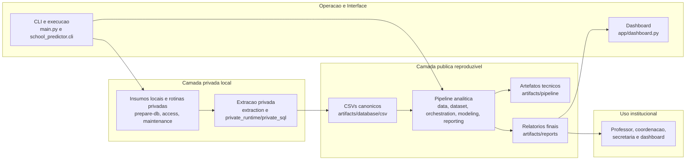

# Arquitetura da Solucao

Este diagrama resume a arquitetura final em blocos maiores, priorizando a leitura do caminho dos dados e das responsabilidades principais da solucao.

## Leitura rapida

- a camada privada local prepara os insumos e gera os CSVs canonicos fora do Git;
- os CSVs canonicos sao a interface publica de entrada da pipeline;
- a pipeline analitica produz artefatos tecnicos e relatorios finais;
- a escola e o dashboard consomem apenas os relatorios finais.
