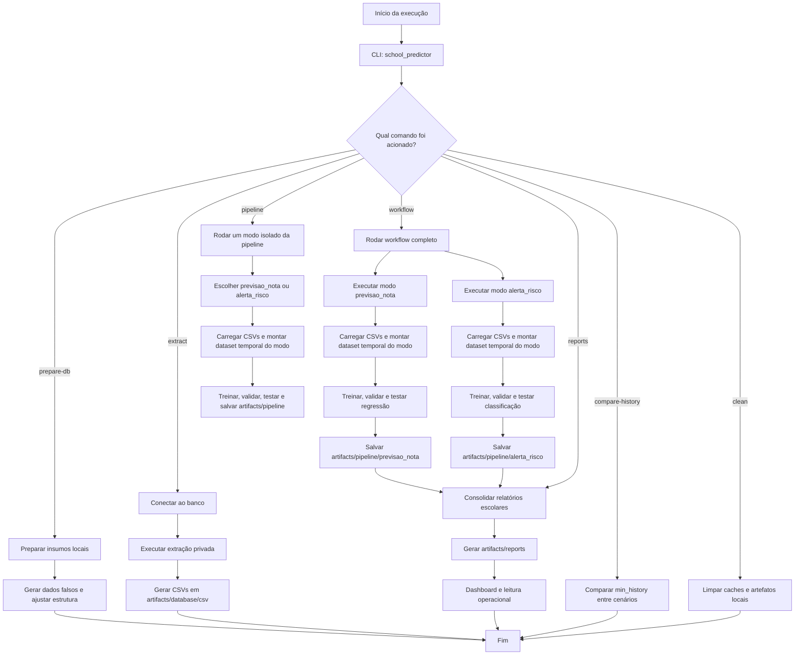

# Fluxo da Pipeline

Este diagrama representa o fluxo operacional principal do projeto, desde a preparação opcional dos insumos locais até a geração dos relatórios e o consumo pelo dashboard.

## Leitura rápida

- `prepare-db` atua nos insumos locais e é opcional, usado quando a base pública precisa ser atualizada.
- `extract` transforma os insumos preparados em CSVs canônicos.
- `workflow` é o fluxo principal do TCC: roda os dois modos técnicos, salva os artefatos de cada um e consolida os relatórios finais.
- `pipeline` executa apenas um modo isolado, útil para depuração e análises específicas.
- `previsao_nota` e `alerta_risco` partem dos mesmos CSVs canônicos, mas cada modo reconstrói seu próprio dataset temporal com corte de histórico diferente.
- o dashboard consome apenas os relatórios finais, não treina modelos.
